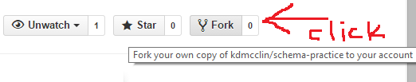

This is meant as a supplementary set of schema design exercises (like what James and I have done on the whiteboards) to help firm up conceptualizing tables.  Feel free to take as much or little of this in as is helpful.  

The schema-explanations directory contains examples of four different schema designs.  A lone table, a one-to-one, a one-to-many, and a many-to-many.

#Repository Instructions
1.  Fork the repo to your own GitHub.

2.  Clone the repo to your local machine.
		git@github.com:your_name/schema-practice.git
		https://github.com/your_name/schema-practice.git

3.
