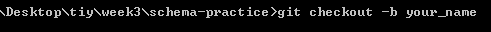
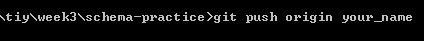
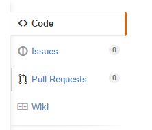
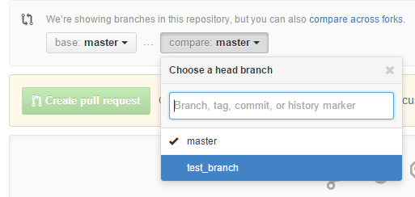
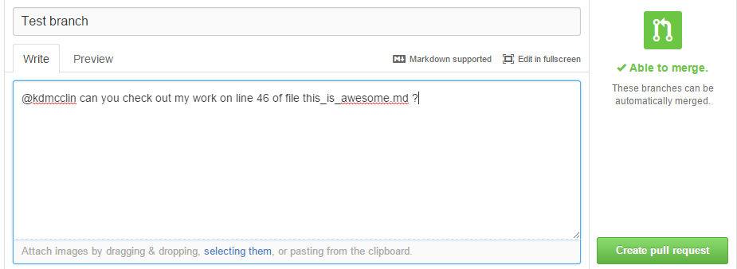

This is meant as a supplementary set of schema design exercises (like what James and I have done on the whiteboards) to help firm up conceptualizing tables.  Feel free to take as much or little of this in as is helpful.  

The schema-explanations directory contains examples of four different schema designs.  A lone table, a one-to-one, a one-to-many, and a many-to-many.  You don't have to clone this repo if you just want to look at the schema-explorations directory, but feel free.  You will need to clone it if you want to do any of the exercises and have me look at them.

#Repository Instructions
1.  Clone this repo down to your local machine.

2.  Create a new branch with your name.

3.  Work on as much of it as you want to work on.

4.  Push your solutions up to your branch.
  
Don't push to master.  DON'T PUSH TO MASTER.  **Don't push to master.**
Is it reversible?  Pretend it's not.  On a larger project you're working on it would be a pain to undo so get good git habits now.

5.  Click the pull request button to start the pull request process.  Click through until you get to a branch select screen.  

6.  Choose your branch from the dropdown menu.

7.  Fill out your pull request and @me if there's anything in particular you want me to look at.  Ignore the other stuff and click "create pull request"
